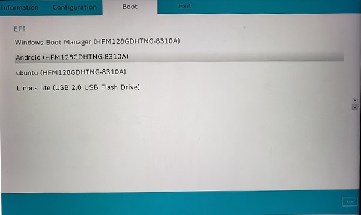

# Yoga Book C930 Android x86 Installation Guide

**Disclaimer: Even I've tested the process several times, there are still chances you may brick your device or loss data, you are on your own risk.**

You may want to read the [Official Installation Guide](https://www.android-x86.org/installhowto.html) first.

If you are familiar with the installation process, you may just want grab the [android.cfg](EFI/BOOT/android.cfg) and do it yourself.

## Status

### Works

- WiFi
- Keyboard
- Rotation
- Sound
- Bluetooth
- Backlight
- Pen
- Sleep (with Vulkan support)

  **NOTE**: When boot android, select **Advanced options** > **Android-x86 9.0-r2 - Vulkan support (experimental)**, when boot with Vulkan, both WiFi and Sleep works fine. Otherwise, the screen won't turn off and WiFi will done when the device tried to sleep.

### Doesn't Work

- Camera
- Figure Print

## Download Installation Media

Download the [latest android x86](https://www.android-x86.org/download.html) iso. By the time this guide was created, the latest version is 9.0 r2. The full file name this guide use is: **android-x86_64-9.0-r2.iso**.

**Please note**, you may not want the k49 version. The rotation is not working in Yoga Book C930.

## Create Bootable USB Disk

The following steps can be done in any Windows machine, not necessary your Yoga Book C930.

1. Prepare a 2GB+ USB disk.

2. Download [Rufus](https://rufus.ie/).

3. Burn the ISO to the USB disk (all data in the USB will be erased).

   

4. After Rufus done its job. Download [android.cfg](EFI/BOOT/android.cfg) and replace the efi/boot/android.cfg in USB disk.

   If you are curious or want to make the change by yourself, here is what you need to do:
   

## BIOS Configuration

1. Boot to BIOS Configuration

2. Turn off the Secure Boot

   

3. Turn on the USB Boot

   

## Install Android x86

1. Plug the USB disk to your Yoga Book C930

2. There are 3 ways to get the Android booted

   1. If you are under Windows, go to **Settings > Update & Security > Recovery > Advanced Startup > Restart Now**

      In the boot screen, choose **Use a device** and then choose your USB device name. If USB disk is not listed, use method 2.

   2. Shutdown you Yoga Book C930, hold the **Volume Up** button, and then press Power Button, release Volume Up button when you see the Boot Menu.

3. Now, you should see the Android x86 boot screen **in portrait**.

   

4. Select **Android-x86 9.0-r2 Live** if you just want to try it out.

5. Select **Android-x86 9.0-r2 Installation** to proceed if you want to install Android in your Yoga Book C930.

6. In the **Choose Partition** screen, select a partition you want install to, Android x86 can **co-exist with your Windows file system**.

   

7. **This is very important**, in the **Choose filesystem** screen, choose **Do not re-format**.

   

8. Select **Yes** when you are asked to install GRUB2.

   

9. Then you will be asked to create a data.img to store the user data, I set it to 8192, which is 8GB. The image file will grow when you use.

10. The installation is done, you can either Run Android directly or Reboot. But you have one last thing to do.

11. The installation will make the Android as a default Boot option. Boot to BIOS, in the **Boot** section, select **EFI**, choose **Windows Boot Manager**, and use the little Arrow in the right side to move the Windows Boot Manager to the top.

    

12. Refer to Step 2 when you want to run Android, but in this time, select **Android** but not the USB device name.

    

13. When you switch to Windows, you will find **android-9.0-r2** folder in the installed partition, all the android files are there, which is very nice.
